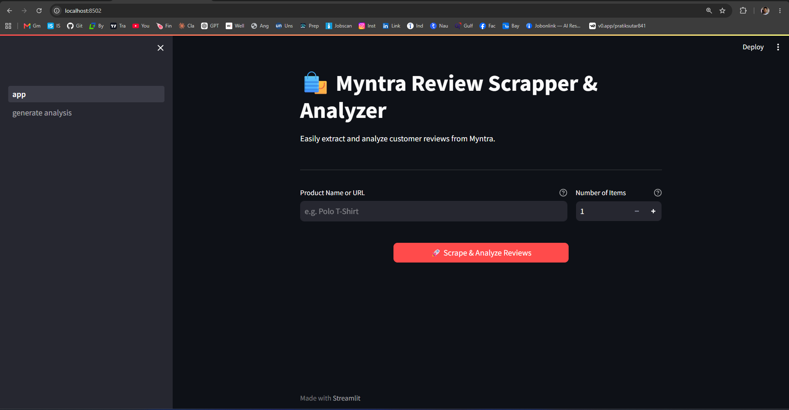
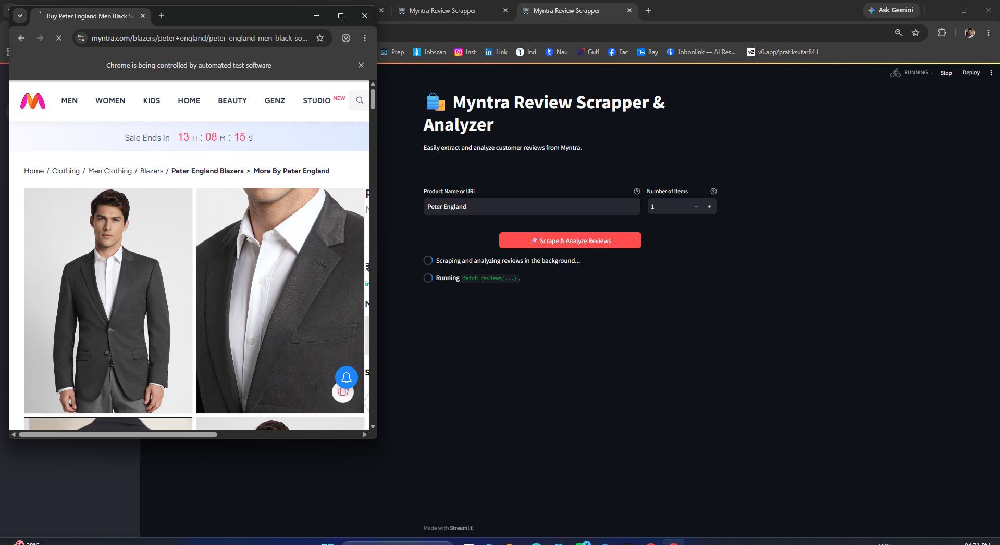
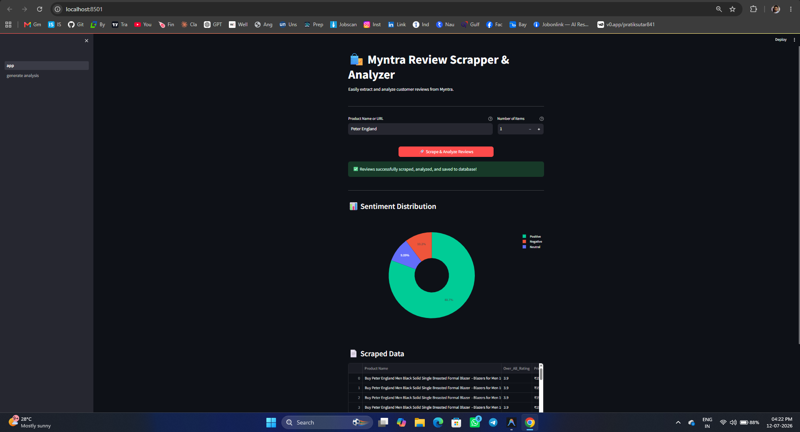
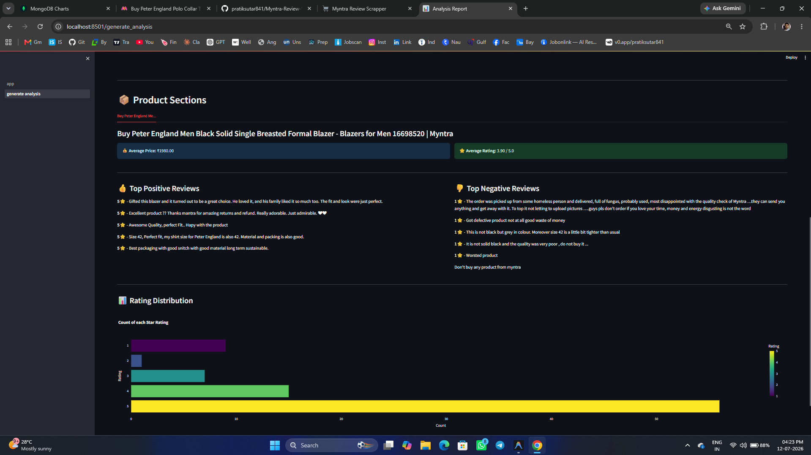

# 🛍️ Myntra Review Scraper & Analyzer

## 📖 Project Summary

This project is a complete end-to-end Myntra review scraper and analyzer. It allows users to extract customer reviews from the Myntra website, save them into a database, and instantly visualize customer sentiment and insights via an interactive dashboard.

### ✨ Key Features
- **Automated Web Scraping**: Extracts product names, pricing, comments, and star ratings automatically using Selenium and BeautifulSoup.
- **NLP Sentiment Analysis**: Uses `VADER Sentiment Analysis` to automatically classify user reviews as Positive, Negative, or Neutral.
- **Interactive Dashboards**: Uses `Plotly` to render interactive, beautiful charts (Pie charts, Bar charts) showing rating distributions and average pricing.
- **Smart Data Caching**: Uses `Streamlit Caching` so repeated searches for the same product load instantly without needing to re-scrape the web.
- **Database Storage**: Seamlessly saves the raw scraped data directly into a MongoDB cluster.

---

## 📸 Screenshots

Here is a glimpse of the application in action:


<br>

<br>

<br>


---

## 🛠️ Technology Stack
- **Frontend & UI**: `Streamlit` (Interactive Python web framework)
- **Data Scraping**: `Selenium`, `BeautifulSoup4`, `ChromeDriver-Binary`
- **Natural Language Processing**: `vaderSentiment` (NLTK-based sentiment analyzer)
- **Data Visualization**: `Plotly Express` & `Plotly Graph Objects`
- **Data Processing**: `Pandas`, `Numpy`
- **Database**: `MongoDB Atlas` & `database-connect` (Python connector)

---

## 🚀 How to Setup & Run Locally

To set up the project locally on your machine, follow these steps exactly:

### 1. Clone the repository
```bash
git clone https://github.com/pratiksutar841/Myntra-Review-Scrapper.git
cd myntra-review-scraper
```

### 2. Create the Conda Environment
Create a fresh python 3.10 environment in the project directory:
```bash
conda create -p ./env python=3.10 -y
```

### 3. Install Dependencies
Instead of relying on standard activation (which sometimes fails on Windows PowerShell), use `conda run` to ensure dependencies install into the correct environment:
```bash
conda run -p ./env pip install -r requirements.txt
```

### 4. Database Setup (Optional)
By default, the application connects to a test MongoDB Atlas cluster. If you want to use your own, replace the `mongodb+srv://` connection string inside `src/cloud_io/__init__.py`. 
*(Note: If the database connection times out, the app will gracefully fall back and still display your data on the screen!)*

### 5. Run the Application
Run the Streamlit server using `conda run` to ensure it uses the isolated environment:
```bash
conda run -p ./env streamlit run app.py
```

### 6. View the App
Access the application in your web browser at [http://localhost:8501](http://localhost:8501).

---

## 💡 About the Architecture
- **No Manual Drivers**: We replaced `chromedriver.exe` with the `chromedriver-binary` PyPI package. This provides better compatibility across Windows, Mac, and Linux without the user needing to manually download driver executables.
- **Multi-page Streamlit App**: The app separates concerns. The main `app.py` handles scraping and saving data, while `pages/generate_analysis.py` renders complex tabs, analytics, and Plotly graphics.

Feel free to explore the codebase and customize the scraper to suit your specific requirements. If you encounter any issues or have suggestions for improvement, please open an issue on the GitHub repository.

Happy scraping! 🕵️‍♂️🚀